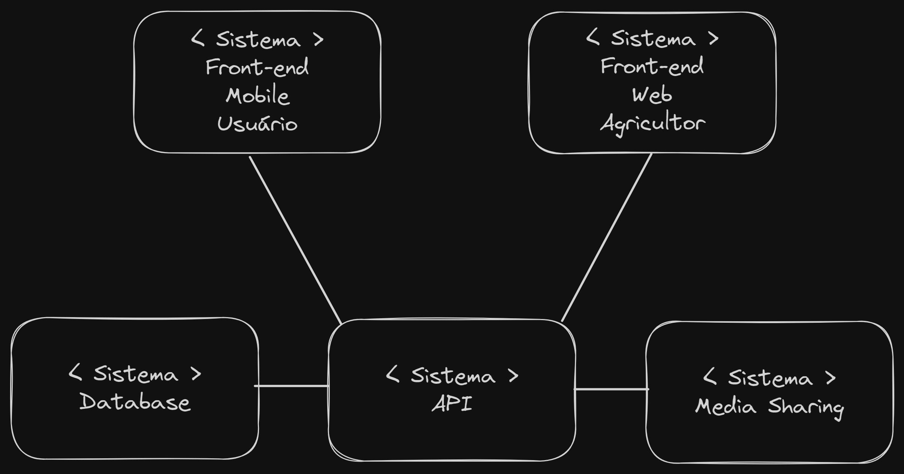

# GreenLink - API

## Contexto e motivações

A agricultura familiar e os pequenos produtores desempenham um papel fundamental na produção de alimentos saudáveis e no cuidado com o meio ambiente. Ao contrário dos métodos convencionais, eles utilizam práticas naturais, evitando o uso de agrotóxicos que são prejudiciais à saúde humana e ao ecossistema.

Com o objetivo de impulsionar esse mercado benéfico tanto para a população como para o meio ambiente, apresentamos a GreenLink: uma nova forma de adquirir frutas, verduras e outros alimentos naturais.

A GreenLink é um marketplace que atua como intermediário entre os pequenos produtores e os consumidores finais. Estabelecemos parcerias com esses produtores, facilitando a venda direta para o público em geral e para empresas alimentícias interessadas em produtos naturais.

## Funcionalidades

- Cadastro, atualização e exclusão de usuários e pequenos agricultores.
- Login e Logoff de usuarios e pequenos agricultores.
- Pesquisa de produtos por categoria e pelo nome do produto.
- Conclusão de pedidos.
- Histórico de compras.
- Sistema de notificação de atualização do status da compra para o usuário e para o agricultor.
- Sistema de avaliação para usuário e pequenos agricultores.
- Painel com detalhes dos agricultores.
- Suporte a diferentes métodos de entrega.
- Cadastro, atualização e exclusão de produtos.
- Visualização de informações de venda por períoro (diário, semanal, mensal).
- Exibição de produtos com baixo estoque.
- Criação de promoções.
- Painel administrativo para os administradores do GreenLink gerenciarem o sistema como um todo.
- Aprovar/Reprovar cadastro de pequenos agricultores.
- Chat entre usuários e agricultores.

Todos os requisitos elencados podem ser encontrados [AQUI](./assets/requirements.md).

## Modelo de contexto simples

